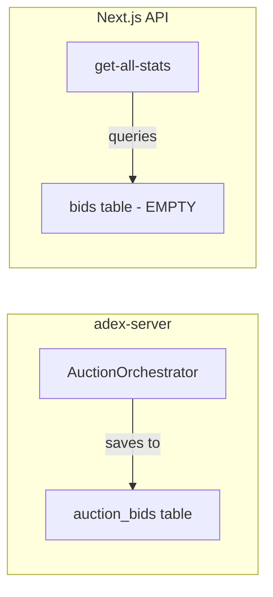

# Fix High Timeout Rate in Auction System

## Problem Analysis

After investigating the codebase, I found **two distinct issues**:

### Issue 1: Stats API Queries Wrong Table

The API endpoint queries `bids` table but the auction orchestrator saves bids to `auction_bids` table:



- [adex-server/src/auction/services/auction-orchestrator.service.ts](adex-server/src/auction/services/auction-orchestrator.service.ts) saves to `auction_bids`
- [app/api/admin/auctions/get-all-stats/route.ts](app/api/admin/auctions/get-all-stats/route.ts) queries from `bids`

This explains why `totalBids: 0` but `withBidsCount: 5539` - bids exist but are being queried from the wrong table.

### Issue 2: High Timeout Rate Root Cause

The auction completion configuration in [auction-orchestrator.service.ts](adex-server/src/auction/services/auction-orchestrator.service.ts):

```typescript
const DEFAULT_CONFIG: AuctionConfig = {
  baseTimeout: 5000, // 5 seconds - reasonable
  minBidsForEarlyComplete: 1, // At least 1 bid
  earlyCompleteThreshold: 0.8, // 80% of expected bids needed
  graceperiod: 500, // 500ms grace period
};
```

With 143 active campaigns, early completion requires ~114 bids (80% of 143). If only 10-20 bots respond, the auction times out waiting for the unrealistic threshold.

The timeout itself is not a bug - auctions ARE receiving bids (97.58% bid rate). They just complete via timeout rather than early completion because the threshold is too high.

## Proposed Fixes

### Fix 1: Update Stats API to Query Correct Table

Update bid metrics query in [app/api/admin/auctions/get-all-stats/route.ts](app/api/admin/auctions/get-all-stats/route.ts) to use `auction_bids` instead of `bids`:

```sql
SELECT
  COUNT(*) as total_bids,
  AVG(bid_amount) as avg_bid_amount,
  AVG(response_time_ms) as avg_response_time_ms
FROM auction_bids
```

### Fix 2: Tune Auction Completion Thresholds (Optional)

Consider adjusting the early completion threshold from 80% to something more realistic like 30-50%, or use a fixed minimum bid count instead of percentage-based threshold. This would reduce timeout completions while still ensuring competitive auctions.

## Load Test Plan

Run 100 auction requests to observe system behavior:

```bash
for i in {1..100}; do
  curl -s 'http://localhost:3003/api/auctions' \
    -H 'Content-Type: application/json' \
    --data-raw '{"publisherId":"62c51d2b-4523-40b9-a6fb-ae4dd50fbf7b","domain":"medium.com","adSlotId":"fb2df6c2-dd7f-4160-8f7f-2f68c60e814d","adSlotType":"banner","floorPrice":0.01,"userContext":{"userAgent":"Mozilla/5.0","countryCode":"EG","device":"desktop","os":"macOS","browser":"Chrome"}}' &
  sleep 0.1
done
wait
```

Monitor:

- adex-server logs for bid reception
- Bot logs for bid publication
- Stats endpoint for updated metrics